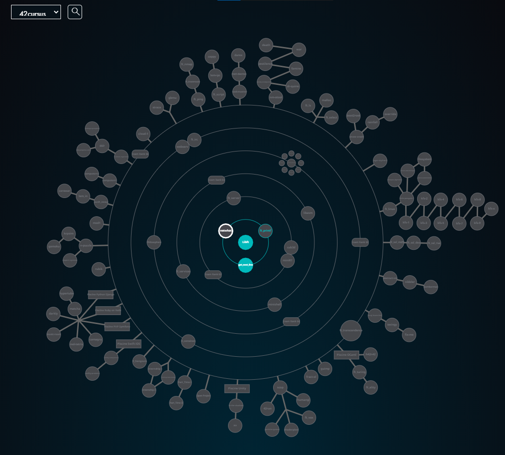

# 42_cursus (2020.06.23)

<!-- 클릭 시 전체화면 -->

-----

## Submitted sources

| Circle | Level |                             Project                             | Language |  Score  | Completion Date |
| :----: | :---: | :-------------------------------------------------------------: | :------: | :-----: | :-------------: |
| Common |   1   |         [**libft**](https://github.com/JUD210/42_libft)         |    C     | 115/100 |   2020.04.18    |
| Common |   2   | [**get_next_line**](https://github.com/JUD210/42_get_next_line) |    C     | 115/100 |   2020.06.23    |

-----

## Contacts

|                                                    |            |                                                            |
| :------------------------------------------------: | :--------: | :--------------------------------------------------------- |
|     |   `Mail`   | <judicious210@gmail.com>                                   |
|       | `42 Intra` | <https://profile.intra.42.fr/users/hmin>                   |
|  | `YouTube`  | <https://www.youtube.com/channel/UCYPWzViA-uq9sBop7ssYaEg> |
|   |   `Blog`   | <https://hyuk.kr/>                                         |
